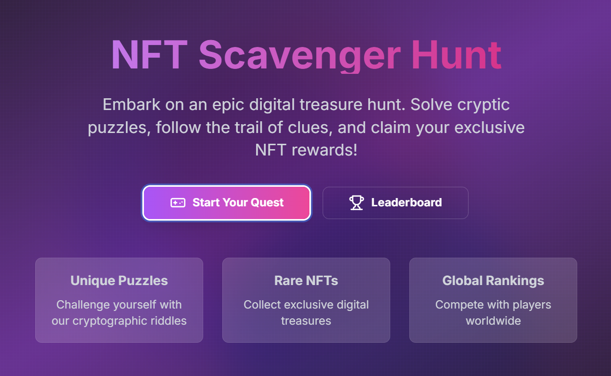

# NFT Scavenger Hunt Game

A gamified blockchain application built on the StarkNet ecosystem that combines educational puzzles with NFT rewards. Players can solve cryptographic riddles and blockchain-related challenges to earn unique NFTs while learning about the StarkNet ecosystem.

## Features

- Interactive puzzle-solving gameplay
- NFT rewards for completed challenges
- Educational blockchain content
- StarkNet ecosystem integration
- Global leaderboard system
- Responsive design with modern UI
- Progress tracking and achievements



## Tech Stack

- Next.js 14
- React 18
- Tailwind CSS
- Lucide React Icons
- Radix UI Components
- Axios for API calls

## Prerequisites

- Node.js 16.x or higher
- npm or yarn package manager
- Basic understanding of React and Next.js

## Installation

1. Clone the repository:

```bash
git clone [repository-url]
cd NFT-Scavenger-Hunt-Game/frontend
```

2. Install dependencies:

```bash
npm install
# or
yarn install
```

3. Start the development server:

```bash
npm run dev
# or
yarn dev
```

4. Open [http://localhost:3000](http://localhost:3000) in your browser to see the application.

## Available Scripts

- `npm run dev` - Starts the development server
- `npm run build` - Builds the application for production
- `npm run start` - Starts the production server
- `npm run lint` - Runs the linter to check for code issues

## Project Structure

```
NFT-Scavenger-Hunt-Game/frontend/
├── components/         # Reusable UI components
├── pages/             # Next.js pages and routes
│   ├── index.js       # Homepage
│   ├── game.js        # Game interface
│   └── leaderboard.js # Leaderboard page
├── public/            # Static assets
└── styles/           # Global styles and Tailwind config
```

## Dependencies

### Production Dependencies

- `@radix-ui/react-slot`: ^1.1.1
- `axios`: ^1.7.9
- `class-variance-authority`: ^0.7.1
- `clsx`: ^2.1.1
- `lucide-react`: ^0.471.1
- `next`: 14.2.4
- `react`: ^18
- `react-dom`: ^18
- `tailwind-merge`: ^2.6.0
- `tailwindcss-animate`: ^1.0.7

### Development Dependencies

- `autoprefixer`: ^10.4.20
- `eslint`: ^8
- `eslint-config-next`: 14.2.4
- `postcss`: ^8.5.1
- `tailwindcss`: ^3.4.17

## Contributing

1. Fork the repository
2. Create your feature branch (`git checkout -b feature/AmazingFeature`)
3. Commit your changes (`git commit -m 'Add some AmazingFeature'`)
4. Push to the branch (`git push origin feature/AmazingFeature`)
5. Open a Pull Request

## License

This project is licensed under the MIT License - see the LICENSE file for details.

## Support

For support, please open an issue in the repository or contact the development team.

## Acknowledgments

- StarkNet ecosystem
- Next.js team
- Tailwind CSS team
- All contributors and supporters
